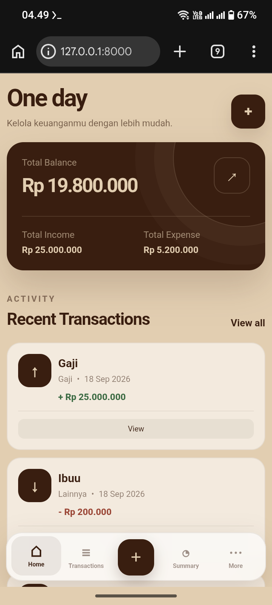
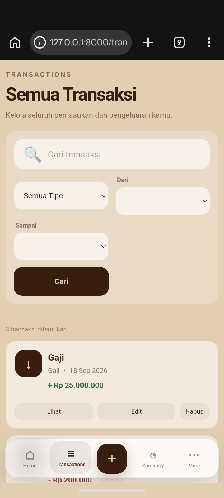
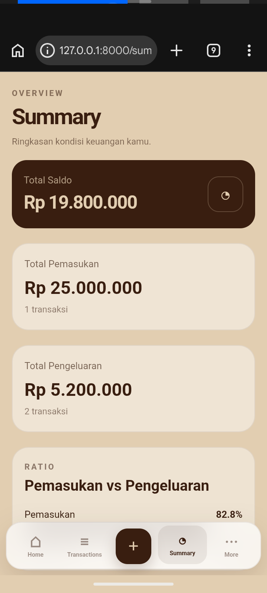

💰 Personal Finance

  <strong>Simple Personal Finance Tracker built with Laravel</strong>

  A web application for managing personal income and expenses in a simple, clean, and responsive interface.

  
  
  
  

  <a href="#-features">Features</a> •
  <a href="#-preview">Preview</a> •
  <a href="#-tech-stack">Tech Stack</a> •
  <a href="#-installation">Installation</a>

---

📖 About

Personal Finance is a personal finance management application built with Laravel and MySQL.

The application is designed to make it easier to record and monitor daily financial transactions through a simple and responsive interface.

This project is also part of my journey to learn and understand Laravel fundamentals, MVC architecture, database relationships, CRUD operations, Blade templates, and responsive web development.

---

✨ Features

🏠 Home

A simple dashboard that provides an overview of personal finances.

💸 Transactions

Manage financial transactions such as:

- Add income
- Add expenses
- View transactions
- Edit transactions
- Delete transactions

📊 Summary

View a summary of financial activity to understand income, expenses, and overall balance.

⚙️ More

Additional application options and information.

📱 Responsive

Designed to work on:

- 📱 Mobile
- 📲 Tablet
- 💻 Desktop

---

🖥️ Preview

«Screenshots will be added as the project develops.»

🏠 Home

  

💸 Transactions

  

📊 Summary

  

---

🛠️ Tech Stack

Technology| Purpose
🐘 PHP| Backend programming language
🔥 Laravel| Web application framework
🗄️ MySQL| Database
🎨 Blade| Laravel templating engine
🌐 HTML| Page structure
🎨 CSS| User interface & responsive design
⚡ JavaScript| Client-side interaction

---

📂 Project Structure

personalFinance/
│
├── app/
│   ├── Http/
│   ├── Models/
│   └── ...
│
├── bootstrap/
├── config/
├── database/
│   ├── migrations/
│   └── seeders/
│
├── public/
│   ├── css/
│   ├── js/
│   └── ...
│
├── resources/
│   └── views/
│       ├── home/
│       ├── transactions/
│       ├── summary/
│       └── more/
│
├── routes/
│   └── web.php
│
├── storage/
├── tests/
│
├── .env.example
├── artisan
├── composer.json
├── composer.lock
└── README.md

---

🚀 Installation

1. Clone Repository

git clone https://github.com/zhnif/personalFinance.git

2. Enter Project

cd personalFinance

3. Install Dependencies

composer install

4. Create Environment File

cp .env.example .env

5. Generate Application Key

php artisan key:generate

6. Configure Database

Open the ".env" file and configure your MySQL database:

DB_CONNECTION=mysql
DB_HOST=127.0.0.1
DB_PORT=3306
DB_DATABASE=personal_finance
DB_USERNAME=root
DB_PASSWORD=

Create the database first, then run:

php artisan migrate

7. Start Laravel

php artisan serve

Open the application in your browser:

http://127.0.0.1:8000

---

🔐 Environment

Do not upload your ".env" file to GitHub.

The ".env" file may contain sensitive configuration such as:

- Database credentials
- Application keys
- API keys
- Environment settings

Use ".env.example" as the configuration template.

---

📚 What I'm Learning

Through this project, I'm learning and practicing:

- Laravel fundamentals
- MVC architecture
- Routing
- Controllers
- Models
- Eloquent ORM
- Blade templates
- MySQL
- CRUD operations
- Form validation
- Database migrations
- Responsive web design
- Git & GitHub

---

🗺️ Roadmap

- [x] Laravel project setup
- [x] Basic navigation
- [x] Home page
- [x] Transactions page
- [x] Summary page
- [x] More page
- [ ] Transaction CRUD
- [ ] Form validation
- [ ] Database relationships
- [ ] Financial statistics
- [ ] Improved dashboard
- [ ] Authentication
- [ ] Deployment

---

📌 Project Status

🚧 In Development

This project is continuously being developed as a Laravel learning and portfolio project.

---

👨‍💻 Author

Zaim Hanif Murtadlo

Student & Web Development Learner

GitHub: "@zhnif" (https://github.com/zhnif)

---

  made with zhnif

